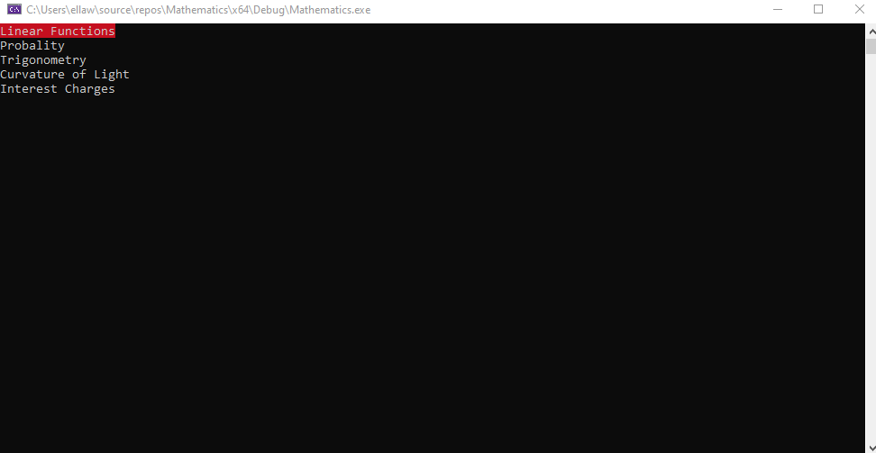

# Mathematics

Is a simple programm in C++ for calculating math things.



## Installation

Use the git clone command to install the code.

```bash
git clone https://github.com/Pawelgit1234/Mathematics.git
```

## Contributing

Pull requests are welcome. For major changes, please open an issue first
to discuss what you would like to change.

Please make sure to update tests as appropriate.

## License

[MIT](https://choosealicense.com/licenses/mit/)
